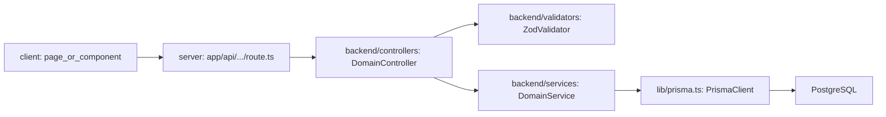

## Architecture Quickview (For Coding Agents)

This file compresses the core architecture and call flow so you can quickly locate where to read or modify code.

### High-Level Layers

- `app/`
  - Pages and layouts (Next.js App Router).
  - `app/projects/**`, `app/dashboard/**`, `app/auth/**`, `app/admin/**`, etc. – UI entrypoints.
  - `app/api/**/route.ts` – HTTP boundary and REST API route handlers.
- `backend/controllers/**`
  - Domain controllers used by API routes.
  - Parse `NextRequest`, read query/body, call validators, delegate to services, shape responses.
- `backend/services/**`
  - Domain business logic and orchestration.
  - Use Prisma via `lib/prisma.ts`, trigger side effects (email, S3, etc.).
- `backend/validators/**`
  - Zod schemas grouped by domain (`project.validator.ts`, `testcase.validator.ts`, `defect/index.ts`, etc.).
  - Used by controllers for input validation.
- `lib/**`
  - Cross‑cutting infrastructure: `auth.ts`, `rbac/**`, `prisma.ts`, `s3/**`, `email-service.ts`, date/util helpers.
- `prisma/**`
  - `schema.prisma`, migrations, seeding scripts.

Deeper explanations live in:
- [docs/architecture/README.md](../architecture/README.md)
- [docs/architecture/patterns.md](../architecture/patterns.md)

### Standard Request Flow

Conceptual sequence for most APIs:

In words:

1. **Client UI** calls `/api/...` (from a server component, server action, or client fetch).
2. **API route** in `app/api/<resource>/route.ts`:
   - Gets session via `getServerSession(authOptions)` from `lib/auth.ts`.
   - Handles top‑level error translation to `NextResponse`.
   - Delegates to a method on a controller class.
3. **Controller** in `backend/controllers/<domain>/controller.ts`:
   - Parses URL/search params and body.
   - Validates input using Zod from `backend/validators/**`.
   - Calls service methods with validated data and user/context info.
4. **Service** in `backend/services/<domain>/services.ts`:
   - Contains domain logic and cross‑entity operations.
   - Uses `prisma` from `lib/prisma.ts` for DB access.
   - May call email or S3 helpers for side effects.
5. **Prisma** executes queries against the database and returns results.
6. Responses propagate back up, optionally transformed by service/controller, then serialized by the API route.

### Auth & RBAC in the Flow

- **NextAuth config:** `lib/auth.ts`
  - Providers, callbacks, and JWT/session setup.
- **API routes:** use `getServerSession(authOptions)` to enforce authentication.
- **Permissions:**
  - Backend: helpers in `lib/rbac/**` and checks inside controllers/services.
  - Frontend: `hooks/usePermissions.ts` to enable/disable UI actions and routes.

When implementing new logic:
- Reuse the same patterns (session read, permission checks, controllers/services).
- Do not bypass RBAC by calling Prisma directly from route handlers unless the existing pattern for that resource already does so.

### Typical File Set Per Domain

For any core domain (e.g., projects, test cases, test suites, test runs, defects, modules, members):

- **API routes:** `app/api/<resource>/**/route.ts`
- **Controller:** `backend/controllers/<resource>/controller.ts`
- **Service:** `backend/services/<resource>/services.ts`
- **Validators:** `backend/validators/<resource>*.ts`
- **Frontend pages/components:** under `app/projects/...` and `frontend/components/<resource>/**`
- **Types (frontend):** `frontend/components/<resource>/types.ts`

Use [domain-cheatsheets.md](./domain-cheatsheets.md) for concrete file lists for each major domain.

